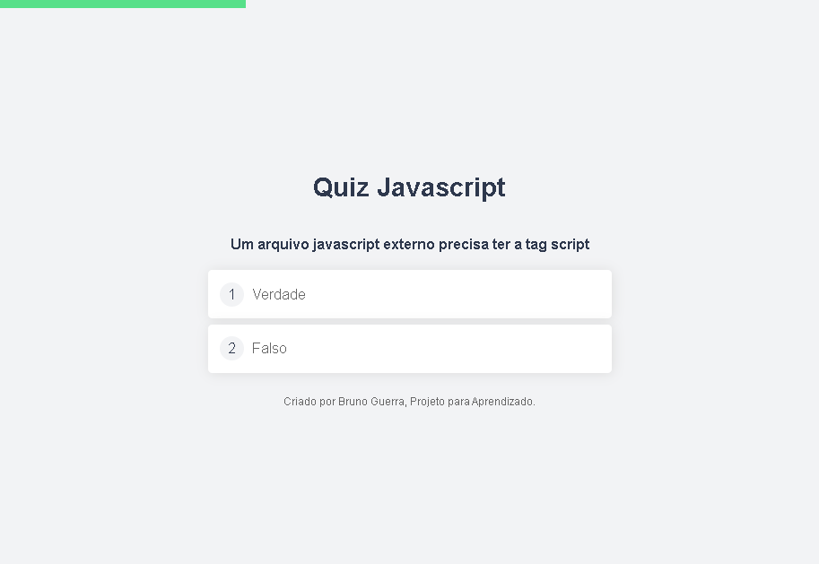
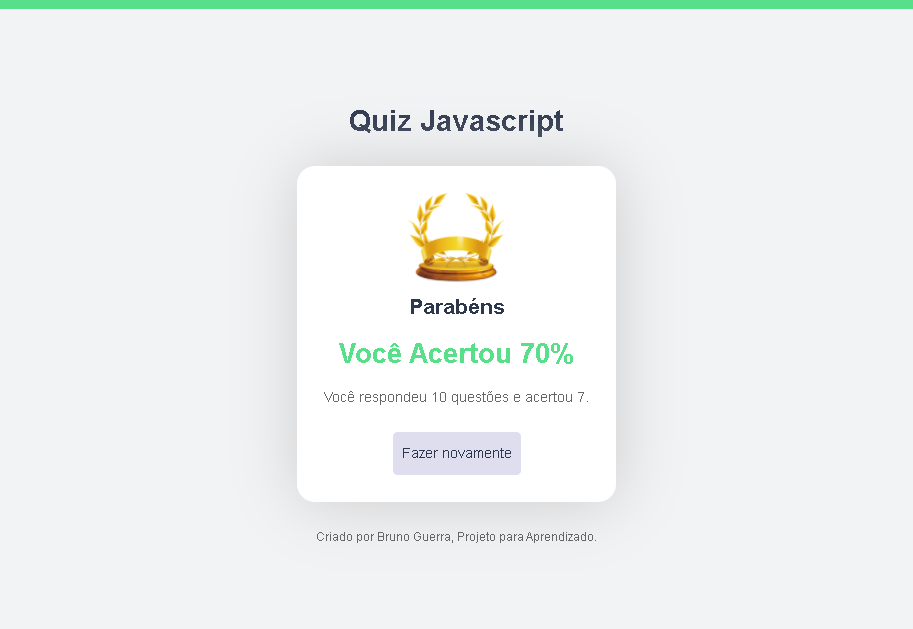

- Simple quiz, made in vanilla javascript. project for learning.

## Quiz

## Links

- Deploy on Netlify: https://js-vanilla-quiz.netlify.app/
- Repository: https://github.com/brunorguerra/quiz-js-vanilla

## Versioning

1.0.0.0

## Authors

- **Bruno Bernardes Guerra**

Please follow github and join us!
Thanks to visiting me and good coding!
